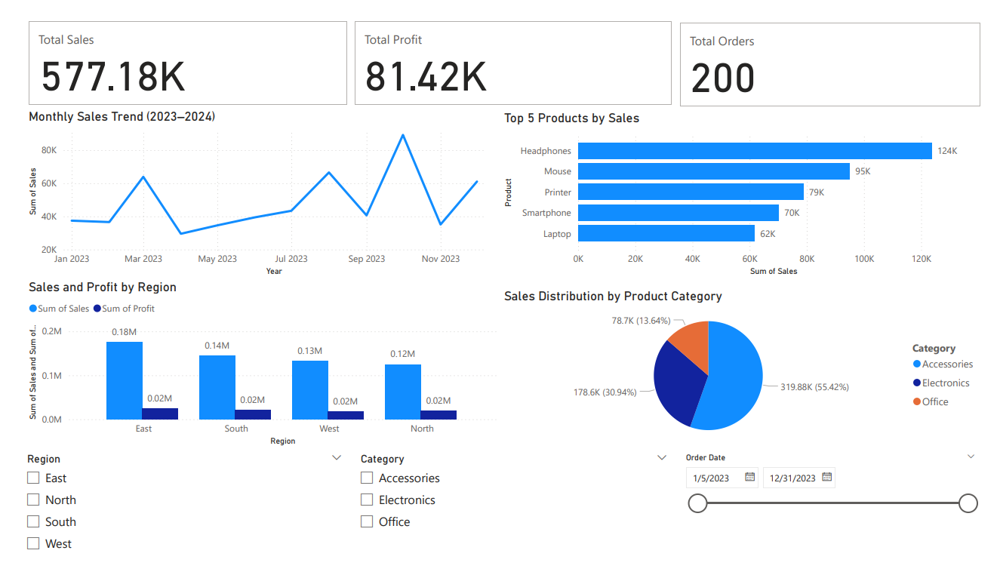

# Retail Sales Dashboard – Data Analyst Portfolio Project

This project showcases a complete data analysis workflow from data cleaning to visualization using Power BI.

# Project Overview
- Cleaned and transformed a retail sales dataset (200+ records)
- Created calculated fields (e.g., profit margin), removed duplicates, and standardized formats
- Designed a Power BI dashboard with KPI cards, time-series charts, bar/pie visuals, and slicers
- Generated insights by product, region, and time to support strategic decisions

# Tools Used
- Power BI
- Excel / Power Query
- SQL (basic data exploration)
- Data: `sales_data_project.csv`

# Screenshot

# Files
- `sales project dashboard.pbix`: Power BI file
- `sales_data_project.csv`: Sample dataset
- `README.md`: You’re reading it :)

# Key Takeaways
- North region had the highest revenue
- Accessories yielded stronger profit margins than Electronics
- Sales peaked in Q4, indicating seasonal buying trends
 
